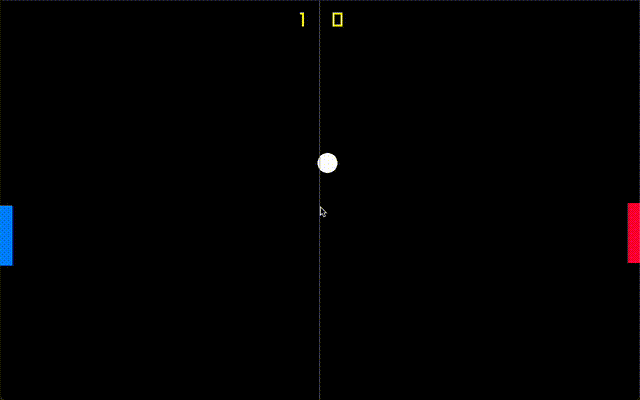

# Pong Game (C++)

A Pong clong build in **C++** using the Raylib game programming library.
This project is part of my practice learning C++ and to upgrade its format as if it were production-ready.

## GIF


___

## Features
- Classic Pong Gameplay (player vs. CPU)
- Player and CPU paddles with collision detection.
- Scoreboard system (first to 3 points wins).
- Multiple game states (Main Menu, Playing, Win/Lose).
- Structured with classes (Ball, Paddle, CpuPaddle).

---

## Getting Started

### Prerequisites
- **C++ compiler** ('clang++' or 'g++')
- **Raylib** (installed via Homebrew on macOS):
  ```bash
  brew install raylib
  ```
## Clone the Repo
```bash
git clone https://github.com/sanketsriv22/pong.git
cd pong
```

## Build and Run
If using VSCode, just run build task (Cmd + Shift + B)
```bash
g++ -std=c++20 -I/opt/homebrew/Cellar/raylib/5.5/include \
    -L/opt/homebrew/Cellar/raylib/5.5/lib \
    -lraylib *.cpp -o Pong
./Pong
```

## Controls
- W (up), S (down) -> move player paddle
- Enter -> start game / restart after game over
- Esc -> quit

## Future Improvements
- Usage of 'Game' class to hold all environment object instances
- Two-player mode
- Sound effects
- Better AI for CPU paddle
- Different game modes/difficulties
- Customizable win conditions
